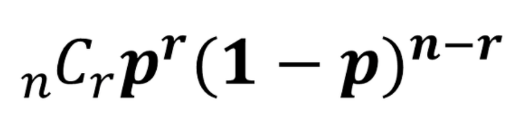

<h1>이항 근사</h1>
이항분포의 반복을 통한 이산분포의 근사

<h3>이항분포 복습</h3>
먼제 결과가 두 가지 중 하나만 나오는 시행을 베르누이 시행이라고 한다.
베르누이 시행의 결과를 0 또는 1로 바꾼 것을 베르누이 확률변수라고 한다.
베르누이 확률변수는 두 값 중 하나만 가질 수 있으므로 이산확률변수이다.
이 베르누이 확률변수의 분포를 베르누이 확률분포 혹은 베르누이 분포라고 이야기 한다.
  
**이항분포**는 연속된 n번의 독립적인 시행에서 각 시행이 확률 p를 가질 때의 이산확률분포이다.
다르게 말하면 **베르누이 시행이 여러 번 일어났을 때의 확률분포**라고 생각하면 된다.
n=1일 때 이항분포는 베르누이 분포이다.

bin(n,p)의 기댓값은 np이고 분산은 np(1-p)이다.

사건 A가 일어날 확률이 p일 때, n회의 독립시행에서 사건 A가 r회 일어날 확률

 

<h3>R을 이용한 이항분포의 실험</h3>
이항분포는 이항 시행을 나타내며 주어진 횟수의 독립적인 베르누이 시행을 반복하는 경우에 사용된다