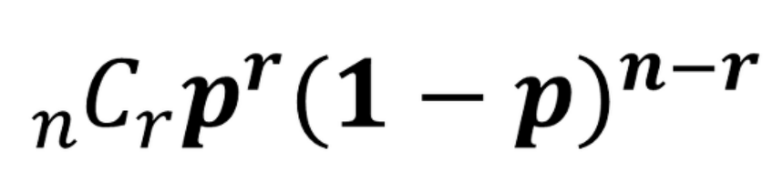
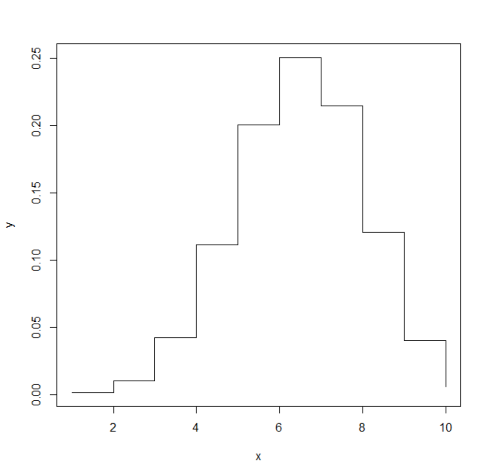
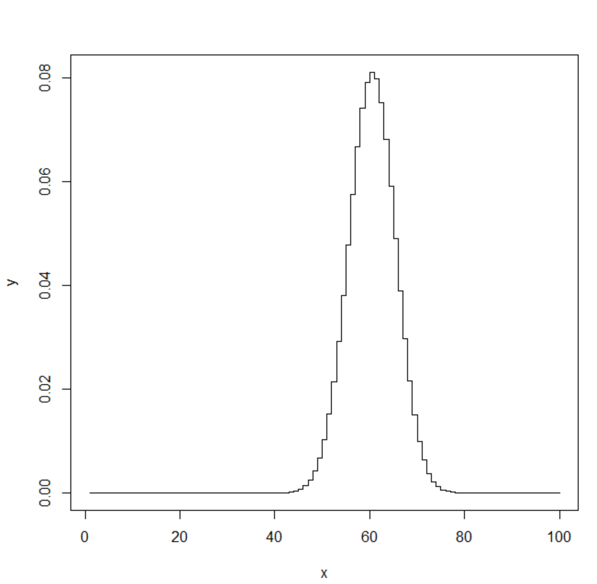
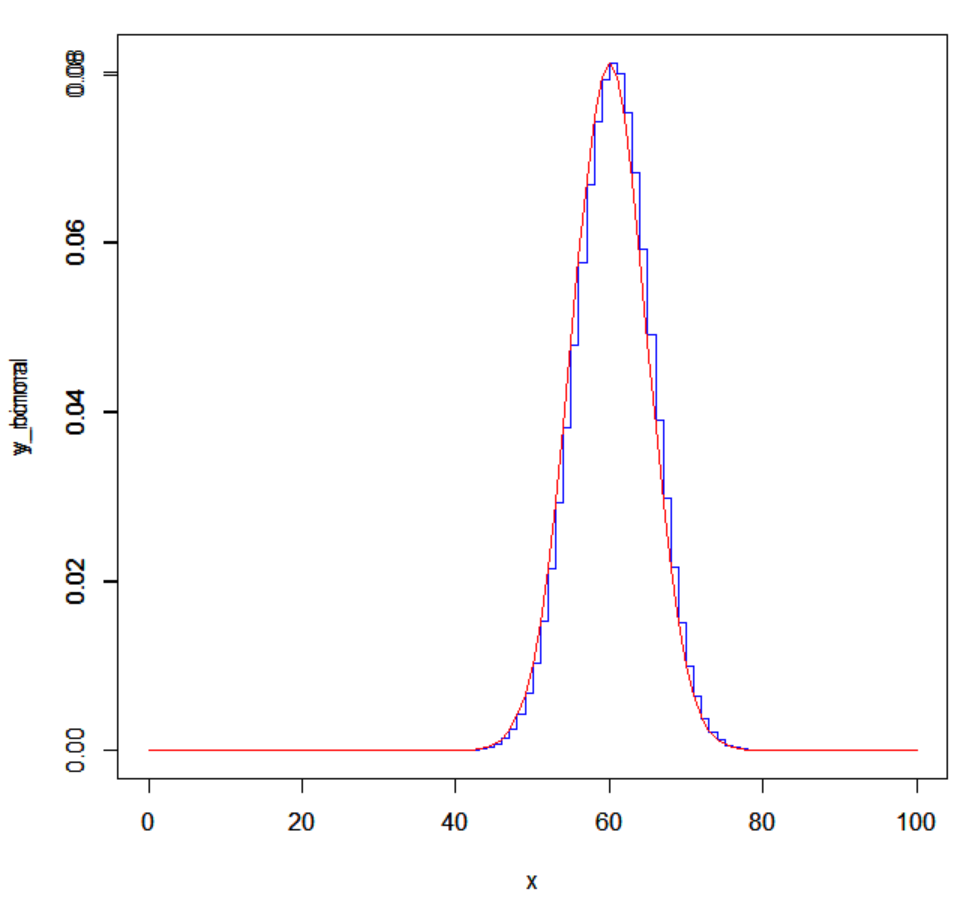

<h1>이항 근사</h1>
이항분포의 반복을 통한 이산분포의 근사

<h3>이항분포 복습</h3>
먼제 결과가 두 가지 중 하나만 나오는 시행을 베르누이 시행이라고 한다.
베르누이 시행의 결과를 0 또는 1로 바꾼 것을 베르누이 확률변수라고 한다.
베르누이 확률변수는 두 값 중 하나만 가질 수 있으므로 이산확률변수이다.
이 베르누이 확률변수의 분포를 베르누이 확률분포 혹은 베르누이 분포라고 이야기 한다.
<br><br>
**이항분포**는 연속된 n번의 독립적인 시행에서 각 시행이 확률 p를 가질 때의 이산확률분포이다.
다르게 말하면 **베르누이 시행이 여러 번 일어났을 때의 확률분포**라고 생각하면 된다.
n=1일 때 이항분포는 베르누이 분포이다.

bin(n,p)의 기댓값은 np이고 분산은 np(1-p)이다.

사건 A가 일어날 확률이 p일 때, n회의 독립시행에서 사건 A가 r회 일어날 확률



<br>

<h3>R을 이용한 이항분포의 실험</h3>
이항분포는 이항 시행을 나타내며 주어진 횟수의 독립적인 베르누이 시행을 반복하는 경우에 사용된다

1. dbinom(x, size, prob)
    * 이항분포에서 x번의 성공이 나타날 확률을 계산
    * x: 성공횟수를 나타내는 값
    * size: 시행의 횟수를 나타내는 값
    * prob: 각 시행에서 성공확률을 나타내는 값
2. pbinom(q, size, prob, lower.tail.log.p)
    * 이항분포에서 q이하의 성공횟수가 나타날 누적 확률을 계산하는 함수
    * q: 누적분포함수를 계산할 대 성곡 횟수의 상한을 나타내는 값
    * size: 시행의 횟수를 나타내는 값
    * prob: 각 시행에서 성공확률을 나타내는 값
    * lower.tail: TRUE인 경우 누적분포함수를 왼쪽에서 계산하며 FALSE인 경우 오른쪽에서 계산
    * log.p: TRUE인 경우 로그확률을 반환
3. qbinom(p, size, prob, lower.tail):
    * 이항분포에서 주어진 누적 확률 p를 만족하는 성공 횟수를 계산하는 함수
    * p: 누적 분포 함수의 값.
    * size: 시행의 횟수를 나타내는 값.
    * prob: 각 시행에서 성공 확률을 나타내는 값.
    * lower.tail: TRUE인 경우 누적 분포 함수를 왼쪽에서 계산하며, FALSE인 경우 오른쪽에서 계산
4. rbinom(n, size, prob)
    * 이항분포에서 난수를 생성한는 함수, 각각의 난수는 이항분포를 따름
    * n: 난수 생성 개수
    * size: 시행의 횟수를 나타내는 값
    * prob: 각 시행에서 성공확률을 나타내는 값
<br>

**pdf of bin(10,0.6) and bin(100,0.6)**

```R
x <- 1:10 #변수 x에서 1부터 10까지 할당
y <- dbinom(x, size=10, prob=0.6) #시행횟수 10히, 성공확률 60%

plot(x, y, type = "s") #x와 y 시각화
#s는 step으로 데이터 점사이를 직서으로 연결하는 그래프 의미
```

시행결과:



```R
x <- 1:100 #변수 x에서 1부터 100까지 할당
y <- dbinom(x, size=10, prob=0.6) #시행횟수 10히, 성공확률 60%

plot(x, y, type = "s") #x와 y 시각화
#s는 step으로 데이터 점사이를 직서으로 연결하는 그래프 의미
```

시행결과:



<br>
10회 시행했을 때 보다 100회 시행했을 때 보다 정규분포의 종모양과 비슷해지는 것을 관찰할 수 있는데 이 점에 주목해야한다.
n이 점점 커지면서 이산변수Z는 점점 연속 변수에 가까워지고 막대모양의 히스토그램또한 점점 종모양의 연속곡선으로 바뀌는 것을 발견할 수 있다.
<br><br>
여기서 드 무브아르라는 수학자는 이 곡선에 적합한 함수를 알아낼 수 있다면 적분을 이용하여 확률을 계산할 수 있기 때문에, 확률의 계산이 훨씬 쉬워질 수 있을 것이라는 생각을 하였다.
<br><br>
이항분포가 정규분포와 비스산지 알아보기 위해 정규분포의 pdf를 그려보려고한다.
R에서 정규분포의 pdf를 그리는 방법은 다음과 같다.

<br>

<h3>R을 이용한 정규분포의 실험</h3>
R에서 정규분포를 나타내기 위해 사용하는 함수들은 다음과 같다.

1. dnorm(x, mean = 0, log =FALSE)
    * x: 확률밀도를 계산할 값(실수 벡터)
    * mean: 정규분포의 평균
    * sd: 정규분포의 표준편차
    * log: TRUE로 설정하면 로그 확률을 반환
2. pnorm(q, mean=0, sd=1, lower.tail=TRUE, log.p=FALSE)
    * q: 누적 분포 함수를 계산할 값(실수 벡터)
    * mean: 정규 분포의 평균
    * sd: 정규 분포의 표준 편차
    * lower.tail: TRUE로 설정하면 누적 확률 값을 반환, FALSE로 설정하면 상위 꼬리의 확률 값을 반환
    * log.p: TRUE로 설정하면 로그 확률을 반환
3. qnorm(p, mean = 0, sd = 1, lower.tail = TRUE, log.p = FALSE)
    * p: 누적 분포 함수의 값(0과 1 사이의 실수 벡터)
    * mean: 정규 분포의 평균
    * sd: 정규 분포의 표준 편차
    * lower.tail: TRUE로 설정하면 왼쪽에서 누적 확률 값을 사용, FALSE로 설정하면 오른쪽에서 누적 확률 값을 사용
    * log.p: TRUE로 설정하면 p가 로그 누적 확률 값임을 나타냄
4. rnorm(n, mean = 0, sd = 1)
    * n: 생성할 난수의 개수
    * mean: 정규 분포의 평균
    * sd: 정규 분포의 표준 편차

<br>
일반적으로 bin(n, p)는 다음 조건을 만족하면 정규분포 N(np, npq)에 근사한다고 알려져 있다.
n이 클수록, p가 0.5에 가까울 수록 이 현상이 더 잘 나타난다.

다음과 같은 R코드로 이 현상을 확인할 수 있다.

```R
x <- 0:100
y_binom <- dbinom(x, size=100, prob=0.6) #pmf of binomal
y_normal <-dnorm(x, mean = 60, sd=sqrt(24)) #pdf of normal
plot(x, y_binom, type="s", col="blue") #draw in stair steo
par(new=TRUE)
plot(x, y_normal, type="l", col="red") #draw in line
```

실행결과:



